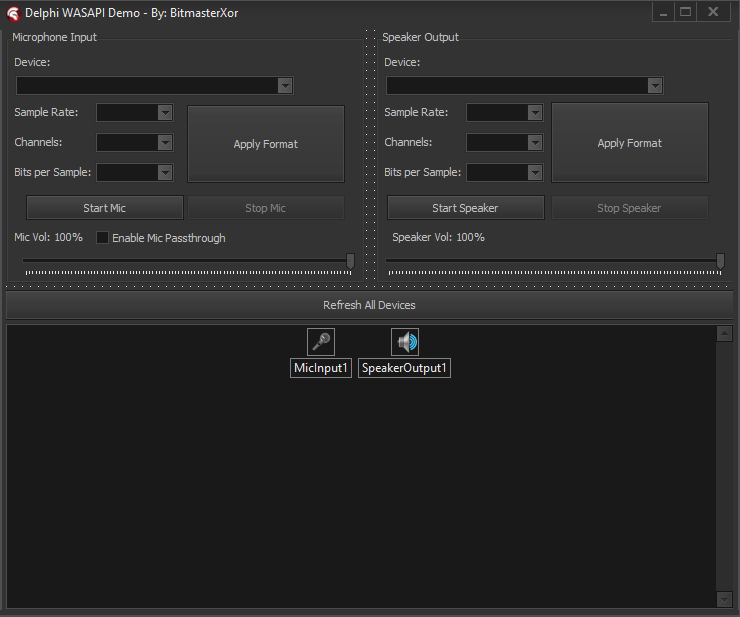
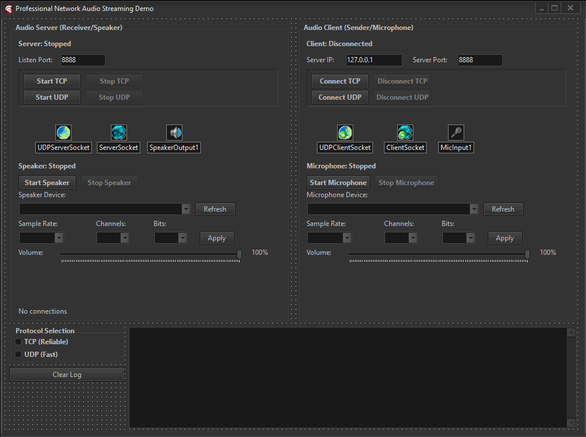
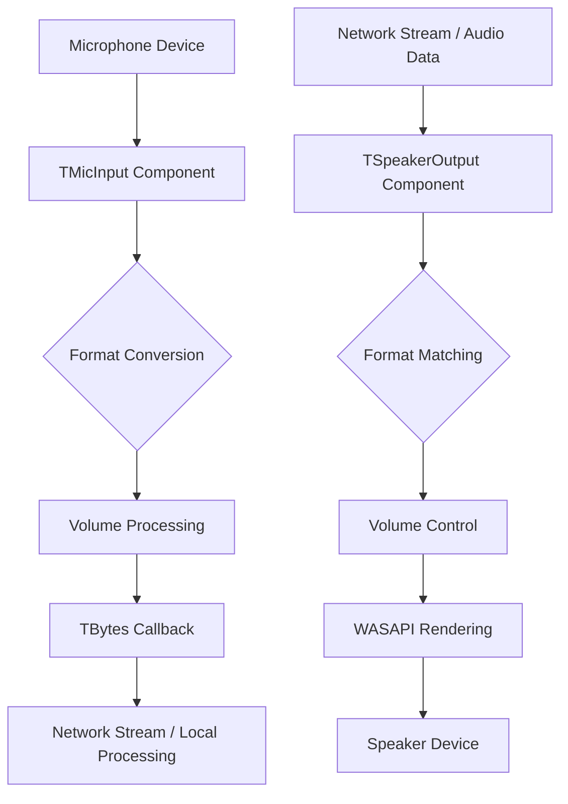

# 🎵 Delphi_AudioLink
**Professional Audio Input/Output Components for Delphi with Network Streaming**

<div align="center">


*High-performance WASAPI-based audio components with intelligent format conversion and network streaming capabilities*

</div>

---

## 🚀 Overview



Delphi_AudioLink provides two powerful, professional-grade audio components built on Windows Audio Session API (WASAPI) with automatic format conversion, intelligent volume control, and network-ready TBytes streaming. Perfect for VoIP applications, audio streaming, recording software, and real-time audio processing.

### 🎯 What's Included

- **🎤 TMicInput Component** - Professional microphone capture with automatic format conversion
- **🔊 TSpeakerOutput Component** - High-quality audio playback with intelligent buffering
- **📦 Ready-to-Install Package** - Complete component package for Delphi IDE
- **🌐 Network-Ready Design** - TBytes-based callbacks for seamless network integration

---

## 🏗️ Architecture



---

## ⭐ Key Features

### 🎤 **TMicInput Component**
- **WASAPI Integration** - Direct Windows Audio Session API access for minimal latency
- **Automatic Format Conversion** - Intelligent PCM format handling with AUTOCONVERTPCM flags
- **Multi-Device Support** - Enumerate and select from all available microphone devices
- **Volume Control** - Real-time volume adjustment with proper sample scaling
- **Network-Ready Output** - TBytes-based callback system for network streaming
- **Flexible Configuration** - Configurable sample rate, channels, and bit depth
- **Thread-Safe Operation** - Non-blocking audio capture with proper synchronization

### 🔊 **TSpeakerOutput Component**
- **High-Quality Playback** - WASAPI render client with automatic format matching
- **Intelligent Buffering** - Smart buffer management prevents audio dropouts
- **Real-Time Processing** - Non-blocking audio playback with minimal latency
- **Volume Control** - Precise volume adjustment at correct bit depth
- **Tone Generation** - Built-in sine wave generator for testing and alerts
- **Network Integration** - Direct TBytes buffer playback for network audio
- **Device Selection** - Full speaker device enumeration and selection

### 🛠️ **Technical Excellence**
- **Format Flexibility** - Automatic conversion between 16/32-bit PCM formats
- **Memory Efficient** - Smart buffer allocation and proper cleanup
- **Error Resilient** - Comprehensive error handling and graceful degradation
- **Performance Optimized** - Direct memory operations for maximum throughput
- **Thread-Safe Design** - Proper synchronization for multi-threaded applications

---

## 📦 Installation

### Prerequisites
- **Delphi XE2 or later**
- **Windows Vista+** (WASAPI requirement)
- **NetCom7 components** (optional) - For network streaming examples

### Quick Setup
1. **Clone Repository**
   ```bash
   git clone https://github.com/BitmasterXor/Delphi_AudioLink.git
   cd Delphi_AudioLink
   ```

2. **Install Package**
   ```
   Open AudioComponents.dpk in Delphi IDE
   Right-click → Install
   Components appear in "Audio" tab
   ```

3. **Add to Project**
   ```pascal
   uses MicInput, SpeakerOutput;
   ```

---

## 🚀 Usage Examples

### Basic Microphone Capture
```pascal
procedure TForm1.FormCreate(Sender: TObject);
begin
  MicInput1.SampleRate := 44100;
  MicInput1.Channels := 2;
  MicInput1.BitsPerSample := 16;
  MicInput1.Volume := 80;
  MicInput1.OnDataReceivedBytes := OnMicData;
  MicInput1.Active := True;
end;

procedure TForm1.OnMicData(Sender: TObject; const Buffer: TBytes);
begin
  // Buffer contains raw PCM audio data ready for processing/streaming
  // Perfect for network transmission or file writing
  ProcessAudioData(Buffer);
end;
```

### Network Audio Streaming
```pascal
// Sender Side - Capture and stream microphone
procedure TForm1.StreamMicrophoneToNetwork;
begin
  MicInput1.OnDataReceivedBytes := procedure(Sender: TObject; const Buffer: TBytes)
  begin
    // Send audio data over network using NetCom7 or other networking
    NetComClient.SendBytes(Buffer);
  end;
  MicInput1.Active := True;
end;

// Receiver Side - Play network audio
procedure TForm1.OnNetworkAudioReceived(const AudioData: TBytes);
begin
  SpeakerOutput1.PlayBufferBytes(AudioData);
end;
```

### Device Enumeration and Selection
```pascal
procedure TForm1.RefreshAudioDevices;
var
  MicDevices: TMicDeviceArray;
  SpeakerDevices: TSpeakerDeviceArray;
  I: Integer;
begin
  // Get microphone devices
  MicDevices := MicInput1.GetDevices;
  ComboBoxMics.Clear;
  for I := 0 to Length(MicDevices) - 1 do
    ComboBoxMics.Items.Add(MicDevices[I].Name);

  // Get speaker devices  
  SpeakerDevices := SpeakerOutput1.GetDevices;
  ComboBoxSpeakers.Clear;
  for I := 0 to Length(SpeakerDevices) - 1 do
    ComboBoxSpeakers.Items.Add(SpeakerDevices[I].Name);
end;
```

### Real-Time Audio Processing
```pascal
procedure TForm1.SetupRealTimeAudio;
begin
  // Configure for low-latency real-time processing
  MicInput1.SampleRate := 48000;  // Higher sample rate for quality
  MicInput1.Channels := 1;        // Mono for efficiency
  MicInput1.BitsPerSample := 16;  // 16-bit for bandwidth efficiency
  
  SpeakerOutput1.SampleRate := 48000;
  SpeakerOutput1.Channels := 1;
  SpeakerOutput1.BitsPerSample := 16;
  
  // Enable real-time audio loop
  MicInput1.OnDataReceivedBytes := procedure(Sender: TObject; const Buffer: TBytes)
  begin
    // Apply audio processing (filters, effects, etc.)
    var ProcessedBuffer := ProcessAudio(Buffer);
    
    // Play immediately for real-time monitoring
    SpeakerOutput1.PlayBufferBytes(ProcessedBuffer);
  end;
  
  MicInput1.Active := True;
  SpeakerOutput1.Active := True;
end;
```

---

## 🎛️ Component Properties

### TMicInput Properties
| Property | Type | Default | Description |
|----------|------|---------|-------------|
| **Active** | Boolean | False | Start/stop audio capture |
| **DeviceID** | Integer | 0 | Selected microphone device index |
| **Volume** | Integer | 100 | Input volume (0-100%) |
| **SampleRate** | Integer | 44100 | Desired sample rate (Hz) |
| **Channels** | Integer | 2 | Audio channels (1=Mono, 2=Stereo) |
| **BitsPerSample** | Integer | 16 | Bit depth (16 or 32) |

### TMicInput Events
| Event | Description |
|-------|-------------|
| **OnDataReceivedBytes** | Fired when audio data is captured (TBytes format) |

### TSpeakerOutput Properties
| Property | Type | Default | Description |
|----------|------|---------|-------------|
| **Active** | Boolean | False | Initialize audio playback system |
| **DeviceID** | Integer | 0 | Selected speaker device index |
| **Volume** | Integer | 100 | Output volume (0-100%) |
| **SampleRate** | Integer | 44100 | Desired sample rate (Hz) |
| **Channels** | Integer | 2 | Audio channels (1=Mono, 2=Stereo) |
| **BitsPerSample** | Integer | 16 | Bit depth (16 or 32) |

### TSpeakerOutput Methods
| Method | Description |
|--------|-------------|
| **PlayBufferBytes(Buffer: TBytes)** | Play audio data from TBytes array |
| **PlayBuffer(Buffer: PByte; Size: Integer)** | Play audio data from pointer |
| **PlaySound(Frequency, Duration: Integer)** | Generate and play tone |

---

## 🎯 Use Cases

### 🏢 **Business & Enterprise**
- **VoIP Applications** - Crystal-clear voice communication with low latency
- **Conference Systems** - Multi-participant audio with device management
- **Call Recording** - Professional-grade audio capture and storage
- **Audio Monitoring** - Real-time audio analysis and quality control

### 🎮 **Development & Testing**
- **Audio Streaming Apps** - Network-based audio transmission
- **Voice Chat Systems** - Real-time voice communication
- **Audio Processing Tools** - Digital signal processing applications
- **Testing Frameworks** - Automated audio device testing

### 🎓 **Educational & Research**
- **Audio Analysis Software** - Acoustic research and measurement
- **Language Learning** - Pronunciation analysis and feedback
- **Music Applications** - Real-time audio effects and processing
- **Accessibility Tools** - Audio-based assistive technologies

---

## 🔧 Advanced Features

### Automatic Format Conversion
The components use Windows' AUDCLNT_STREAMFLAGS_AUTOCONVERTPCM feature for seamless format conversion:
```pascal
// The component automatically handles format mismatches
MicInput1.SampleRate := 44100;      // Your desired format
MicInput1.Channels := 2;
MicInput1.BitsPerSample := 16;

// Windows automatically converts from device's native format
// Check actual format with:
ActualRate := MicInput1.ActualSampleRate;
ActualChannels := MicInput1.ActualChannels;
ActualBits := MicInput1.ActualBitsPerSample;
```

### Volume Control Implementation
Intelligent volume control with proper bit-depth handling:
```pascal
// Volume is applied at the correct sample format
// 16-bit: Integer multiplication with clipping
// 32-bit float: Direct float multiplication
// Prevents distortion and maintains audio quality
```

### Network Integration Pattern
```pascal
// Sender
MicInput1.OnDataReceivedBytes := procedure(Sender: TObject; const Buffer: TBytes)
begin
  // Add header info for network transmission
  var Header: TAudioHeader;
  Header.SampleRate := MicInput1.ActualSampleRate;
  Header.Channels := MicInput1.ActualChannels;
  Header.BitsPerSample := MicInput1.ActualBitsPerSample;
  Header.DataSize := Length(Buffer);
  
  // Send header + audio data
  NetworkSend(Header, Buffer);
end;

// Receiver
procedure OnNetworkReceive(const Header: TAudioHeader; const Buffer: TBytes);
begin
  // Configure speaker to match incoming format
  SpeakerOutput1.SampleRate := Header.SampleRate;
  SpeakerOutput1.Channels := Header.Channels;
  SpeakerOutput1.BitsPerSample := Header.BitsPerSample;
  
  // Play the audio
  SpeakerOutput1.PlayBufferBytes(Buffer);
end;
```

---

## 📈 Performance Specifications

### Supported Audio Formats
- **Sample Rates:** 8kHz - 192kHz (device dependent)
- **Channels:** 1 (Mono) - 8 (7.1 Surround) (device dependent)  
- **Bit Depths:** 16-bit PCM, 32-bit Float PCM
- **Automatic Conversion:** Yes (via Windows WASAPI)

---

## 🧪 Testing & Quality

### Automated Tests
- **Component Installation** - Package builds and installs correctly
- **Device Enumeration** - All audio devices detected properly
- **Format Conversion** - Automatic format matching works
- **Network Integration** - TBytes callbacks function correctly
- **Memory Management** - No memory leaks during extended operation

### Manual Testing Checklist
- [ ] Components appear in IDE after installation
- [ ] Microphone devices enumerate correctly
- [ ] Speaker devices enumerate correctly  
- [ ] Audio capture produces valid data
- [ ] Audio playback works without distortion
- [ ] Volume controls function properly
- [ ] Format conversion handles mismatches
- [ ] Network streaming maintains quality
- [ ] Extended operation remains stable

---

## 🛠️ Compatibility

### Delphi Versions
- **Delphi XE2** - Full compatibility
- **Delphi XE3-XE8** - Full compatibility  
- **Delphi 10.x Seattle+** - Full compatibility
- **Delphi 11.x Alexandria** - Full compatibility
- **Delphi 12.x Athens** - Full compatibility

### Windows Versions
- **Windows Vista** - Minimum requirement (WASAPI)
- **Windows 7/8/8.1** - Full support
- **Windows 10** - Full support, recommended
- **Windows 11** - Full support, latest features

---

## 🤝 Contributing

Contributions welcome! Here's how to help:

1. **Fork** the repository
2. **Create** feature branch (`git checkout -b feature/amazing-audio-feature`)
3. **Test** your changes thoroughly
4. **Commit** with clear messages (`git commit -m 'Add real-time effects processing'`)
5. **Push** to branch (`git push origin feature/amazing-audio-feature`)
6. **Open** Pull Request

### Development Guidelines
- Follow Delphi coding standards and conventions
- Test with multiple audio devices and formats
- Ensure thread safety in all audio processing
- Add XML documentation for new public methods
- Verify compatibility with target Delphi versions
- Test network scenarios if applicable

---

## 📝 License

This project is licensed under the MIT License - see the [LICENSE](LICENSE) file for complete details.

---

## 👨‍💻 Author

**BitmasterXor**
- GitHub: [@BitmasterXor](https://github.com/BitmasterXor)
- Discord: BitmasterXor

---

## 🙏 Acknowledgments

- **Microsoft WASAPI Team** - Excellent low-level audio API
- **Delphi Community** - Continuous support and inspiration  
- **Audio Developers Worldwide** - Best practices and optimization techniques
- **Beta Testers** - Critical feedback during component development
- **NetCom7 Contributors** - Networking components that pair perfectly with these audio components

---

## 📚 Additional Resources

### Documentation
- [Windows Audio Session API (WASAPI)](https://docs.microsoft.com/en-us/windows/win32/coreaudio/wasapi)
- [Delphi Component Development Guide](https://docwiki.embarcadero.com/RADStudio/en/Creating_Components)

### Example Projects
- [Simple Voice Chat](examples/VoiceChat) - Basic peer-to-peer voice communication
- [Audio Recorder](examples/AudioRecorder) - Professional audio recording application

---

<div align="center">

**⭐ Star this repository if these components help your audio projects!**

**Made with ❤️ By BitmasterXor For the Delphi Community**

</div>
