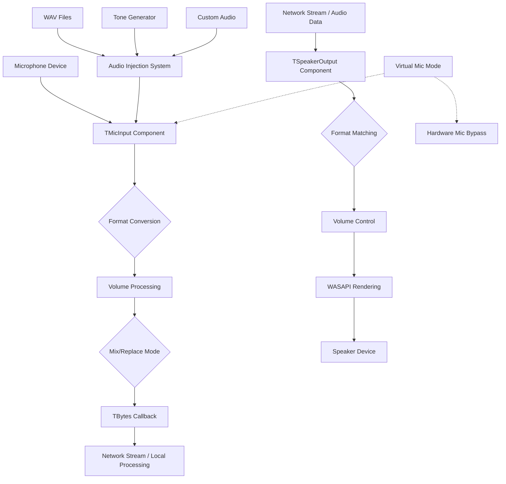

# 🎵 Delphi_AudioComponents
**Professional Audio Input/Output Components for Delphi with Network Streaming & Audio Injection**

<div align="center">


*High-performance WASAPI-based audio components with intelligent format conversion, network streaming capabilities, and advanced audio injection system*

</div>

---

## 🚀 Overview

Delphi_AudioComponents provides two powerful, professional-grade audio components built on Windows Audio Session API (WASAPI) with automatic format conversion, intelligent volume control, network-ready TBytes streaming, and a revolutionary audio injection system. Perfect for VoIP applications, audio streaming, recording software, virtual microphones, and real-time audio processing.

### 🎯 What's Included

- **🎤 TMicInput Component** - Professional microphone capture with virtual microphone mode and audio injection
- **🔊 TSpeakerOutput Component** - High-quality audio playback with intelligent buffering
- **🎛️ Audio Injection System** - Inject WAV files, generated tones, or custom audio into microphone stream
- **🤖 Virtual Microphone Mode** - Pure injection mode bypassing hardware microphone
- **📦 Ready-to-Install Package** - Complete component package for Delphi IDE
- **🌐 Network-Ready Design** - TBytes-based callbacks for seamless network integration

---

## 🏗️ Architecture



---

## ⭐ Key Features

### 🎤 **TMicInput Component - Enhanced**
- **WASAPI Integration** - Direct Windows Audio Session API access for minimal latency
- **Audio Injection System** - Inject WAV files, tones, or custom audio into microphone stream
- **Virtual Microphone Mode** - Pure injection mode without hardware microphone
- **Mix & Replace Modes** - Mix injected audio with microphone or replace completely
- **Independent Volume Controls** - Separate volume control for microphone and injected audio
- **Automatic Format Conversion** - Intelligent PCM format handling with AUTOCONVERTPCM flags
- **Multi-Device Support** - Enumerate and select from all available microphone devices
- **Network-Ready Output** - TBytes-based callback system for network streaming
- **Thread-Safe Operation** - Non-blocking audio capture with proper synchronization

### 🎛️ **Audio Injection System - NEW**
- **WAV File Injection** - Load and inject WAV files with optional looping
- **Tone Generation** - Generate sine wave tones at any frequency and duration
- **Custom Audio Injection** - Inject any TBytes audio data programmatically
- **Volume Control** - Independent volume control for injected audio (0-100%)
- **Loop Support** - Continuous playback of injected audio files
- **Format Matching** - Automatic format conversion to match microphone settings
- **Real-Time Control** - Start, stop, and switch injected audio on-the-fly

### 🤖 **Virtual Microphone Mode - NEW**
- **Hardware Bypass** - Complete bypass of physical microphone
- **Pure Injection** - Stream only injected audio content
- **Network Streaming** - Stream injected content over network connections
- **Format Flexibility** - Define custom audio formats for virtual microphone
- **Perfect for Testing** - Ideal for automated testing and audio simulation

### 🔊 **TSpeakerOutput Component**
- **High-Quality Playback** - WASAPI render client with automatic format matching
- **Intelligent Buffering** - Smart buffer management prevents audio dropouts
- **Real-Time Processing** - Non-blocking audio playback with minimal latency
- **Volume Control** - Precise volume adjustment at correct bit depth
- **Network Integration** - Direct TBytes buffer playback for network audio
- **Device Selection** - Full speaker device enumeration and selection

### 🛠️ **Technical Excellence**
- **Format Flexibility** - Automatic conversion between 16/32-bit PCM formats
- **Memory Efficient** - Smart buffer allocation and proper cleanup
- **Error Resilient** - Comprehensive error handling and graceful degradation
- **Performance Optimized** - Direct memory operations for maximum throughput
- **Thread-Safe Design** - Proper synchronization for multi-threaded applications

---

## 📦 Installation

### Prerequisites
- **Delphi XE2 or later**
- **Windows Vista+** (WASAPI requirement)
- **NetCom7 components** (optional) - For network streaming examples

### Installation Steps
1. Extract components to your Delphi components directory
2. Open `AudioComponents.dpk` in Delphi IDE
3. Build and Install the package
4. Components appear on **"Audio"** tab

---

## 🚀 Usage Examples

### Basic Microphone Capture with Audio Injection
```pascal
procedure TForm1.FormCreate(Sender: TObject);
begin
  MicInput1.VirtualMicMode := False;
  MicInput1.MixInjectedAudio := True;
  MicInput1.OnDataReceivedBytes := OnMicData;
  MicInput1.Active := True;
  
  // Inject a beep tone
  MicInput1.InjectBeep(800, 1000);  // 800Hz for 1000ms
end;

procedure TForm1.OnMicData(Sender: TObject; const Buffer: TBytes);
begin
  // Buffer contains microphone + injected audio mixed together
end;
```

### Virtual Microphone Mode
```pascal
procedure TForm1.FormCreate(Sender: TObject);
begin
  MicInput1.VirtualMicMode := True;   // No hardware microphone
  MicInput1.OnDataReceivedBytes := OnMicData;
  MicInput1.Active := True;
  
  // Inject audio file that will loop continuously
  MicInput1.InjectAudioFile('C:\Audio\background_music.wav', True);
end;
```

### Network Audio Streaming (Sender)
```pascal
// Sender Side - ONE LINE to send over NetCom7
procedure TForm1.OnMicData(Sender: TObject; const Buffer: TBytes);
begin
  NetCom7Client.ExecCommand(1, Buffer);  // DONE!
end;

procedure TForm1.FormCreate(Sender: TObject);
begin
  MicInput1.OnDataReceivedBytes := OnMicData;
  MicInput1.Active := True;
end;
```

### Network Audio Streaming (Receiver)
```pascal
// Receiver Side - ONE LINE to receive and play
procedure TForm1.NetCom7Server1ExecCommand(Sender: TObject; Socket: TCustomWinSocket; 
  const Command: Integer; Data: TBytes);
begin
  if Command = 1 then
    SpeakerOutput1.PlayBufferBytes(Data);  // DONE!
end;

procedure TForm1.FormCreate(Sender: TObject);
begin
  SpeakerOutput1.Active := True;
  NetCom7Server1.Start;
end;
```

### Complete VoIP Application
```pascal
// CLIENT (Sender) - Complete in 4 lines
procedure TForm1.FormCreate(Sender: TObject);
begin
  MicInput1.OnDataReceivedBytes := procedure(Sender: TObject; const Buffer: TBytes)
    begin NetCom7Client.ExecCommand(1, Buffer); end;
  MicInput1.Active := True;
  NetCom7Client.Connect('192.168.1.100', 8080);
end;

// SERVER (Receiver) - Complete in 3 lines  
procedure TForm1.NetCom7Server1ExecCommand(Sender: TObject; Socket: TCustomWinSocket; 
  const Command: Integer; Data: TBytes);
begin
  if Command = 1 then SpeakerOutput1.PlayBufferBytes(Data);
end;

procedure TForm1.FormCreate(Sender: TObject);
begin
  SpeakerOutput1.Active := True;
  NetCom7Server1.Start;
end;
```

### Different Use Cases - Simple Configuration
```pascal
// High quality recording
MicInput1.SampleRate := 48000;
MicInput1.BitsPerSample := 32;

// Low bandwidth VoIP
MicInput1.SampleRate := 8000;
MicInput1.Channels := 1;

// Virtual microphone with background music
MicInput1.VirtualMicMode := True;
MicInput1.InjectAudioFile('background.wav', True);
```

---

## 🎛️ Component Properties

### TMicInput Properties
| Property | Type | Default | Description |
|----------|------|---------|-------------|
| **Active** | Boolean | False | Start/stop audio capture |
| **DeviceID** | Integer | 0 | Selected microphone device index |
| **Volume** | Integer | 100 | Input volume (0-100%) |
| **SampleRate** | Integer | 44100 | Desired sample rate (Hz) |
| **Channels** | Integer | 2 | Audio channels (1=Mono, 2=Stereo) |
| **BitsPerSample** | Integer | 16 | Bit depth (16 or 32) |
| **VirtualMicMode** | Boolean | False | **NEW:** Enable virtual microphone (no hardware mic) |
| **MixInjectedAudio** | Boolean | True | **NEW:** Mix injected audio with microphone |
| **InjectedVolume** | Integer | 100 | **NEW:** Volume for injected audio (0-100%) |

### TMicInput Events
| Event | Description |
|-------|-------------|
| **OnDataReceivedBytes** | Fired when audio data is captured (TBytes format) |

### TMicInput Methods - NEW Audio Injection
| Method | Description |
|--------|-------------|
| **InjectAudioFile(FileName, Loop)** | Inject WAV file with optional looping |
| **InjectAudioBytes(Data, Loop)** | Inject custom TBytes audio data |
| **InjectBeep(Frequency, Duration)** | Generate and inject sine wave tone |
| **StopInjection** | Stop all audio injection |

### TSpeakerOutput Properties
| Property | Type | Default | Description |
|----------|------|---------|-------------|
| **Active** | Boolean | False | Initialize audio playback system |
| **DeviceID** | Integer | 0 | Selected speaker device index |
| **Volume** | Integer | 100 | Output volume (0-100%) |
| **SampleRate** | Integer | 44100 | Desired sample rate (Hz) |
| **Channels** | Integer | 2 | Audio channels (1=Mono, 2=Stereo) |
| **BitsPerSample** | Integer | 16 | Bit depth (16 or 32) |

### TSpeakerOutput Methods
| Method | Description |
|--------|-------------|
| **PlayBufferBytes(Buffer: TBytes)** | Play audio data from TBytes array |
| **PlayBuffer(Buffer: PByte; Size: Integer)** | Play audio data from pointer |

---

## 🎯 Use Cases

### 🏢 **Business & Enterprise**
- **VoIP Applications** - Crystal-clear voice communication with custom audio injection
- **Conference Systems** - Multi-participant audio with background music or alerts
- **Call Recording** - Professional-grade audio capture with notification tones
- **Audio Monitoring** - Real-time audio analysis with test tone injection
- **Virtual Presentations** - Inject background music or sound effects during presentations

### 🎮 **Development & Testing**
- **Audio Streaming Apps** - Network-based audio transmission with custom content
- **Voice Chat Systems** - Real-time voice communication with sound effects
- **Audio Testing Frameworks** - Automated audio testing with controlled audio injection
- **Game Development** - Voice chat with in-game audio effects and notifications
- **Bot Development** - Virtual microphones for automated voice responses

### 🎓 **Educational & Research**
- **Audio Analysis Software** - Acoustic research with controlled test signals
- **Language Learning** - Pronunciation practice with background audio or prompts
- **Music Applications** - Real-time audio effects with backing tracks
- **Accessibility Tools** - Audio-based assistive technologies with custom alerts
- **Audio Simulation** - Simulate various audio environments for research

### 🎵 **Creative & Entertainment**
- **Live Streaming** - Stream with background music, sound effects, or alerts
- **Podcasting** - Inject intro music, transitions, or notification sounds
- **Virtual DJ Applications** - Mix microphone with music tracks
- **Karaoke Systems** - Inject backing tracks while capturing vocals
- **Audio Content Creation** - Create complex audio content with multiple sources

---

## 🔧 Technical Implementation Details

### Audio Injection System Architecture
```pascal
// The injection system uses a sophisticated buffer management system
// that automatically handles format conversion and timing

// Internal structure (simplified):
TAudioInjectionBuffer = class
  - Loads WAV files and converts to PCM
  - Generates sine waves at any frequency
  - Handles looping and position tracking  
  - Provides thread-safe chunk delivery
  - Automatic format matching to microphone
end;
```

### Virtual Microphone Implementation
```pascal
// Virtual microphone mode completely bypasses hardware
if VirtualMicMode then
begin
  // Generate audio chunks from injection system only
  InjectedChunk := InjectionBuffer.GetNextChunk(ChunkSize);
  // Apply volume and send to callback
  SendToCallback(InjectedChunk);
end
else
begin
  // Normal mode: capture from hardware + optional injection
  HardwareAudio := CaptureFromMicrophone();
  if MixInjectedAudio then
    MixedAudio := MixAudio(HardwareAudio, InjectedAudio)
  else
    MixedAudio := HardwareAudio;
  SendToCallback(MixedAudio);
end;
```

### Network Protocol Integration
```pascal
// Perfect for network streaming protocols:
// 1. Capture sends TBytes via OnDataReceivedBytes
// 2. Transmit TBytes over any network protocol
// 3. Receiver plays TBytes via PlayBufferBytes()
// 4. Automatic format conversion and playback
```

---

## 📈 Performance Specifications

### Supported Audio Formats
- **Sample Rates:** 8kHz - 192kHz (device dependent)
- **Channels:** 1 (Mono) - 8 (7.1 Surround) (device dependent)  
- **Bit Depths:** 16-bit PCM, 32-bit Float PCM
- **Automatic Conversion:** Yes (via Windows WASAPI + custom injection matching)
- **Injection Formats:** WAV files (PCM), Generated tones, Custom TBytes

### Audio Injection Performance
- **Latency:** <10ms injection mixing
- **File Formats:** WAV (PCM 16/32-bit)
- **Tone Generation:** 1Hz - 20kHz frequency range
- **Custom Audio:** Any TBytes PCM data
- **Memory Usage:** Efficient streaming with minimal buffer allocation

---

## 🧪 Testing & Quality

### Automated Tests
- **Component Installation** - Package builds and installs correctly
- **Device Enumeration** - All audio devices detected properly
- **Format Conversion** - Automatic format matching works
- **Audio Injection** - WAV file injection functions correctly
- **Virtual Microphone** - Pure injection mode works without hardware
- **Volume Controls** - Independent volume controls function properly
- **Network Integration** - TBytes callbacks with injection work correctly
- **Memory Management** - No memory leaks during extended operation with injection

### Manual Testing Checklist
- [ ] Components appear in IDE after installation
- [ ] Microphone devices enumerate correctly
- [ ] Speaker devices enumerate correctly  
- [ ] Audio capture produces valid data
- [ ] Audio playback works without distortion
- [ ] Volume controls function properly
- [ ] **NEW:** Virtual microphone mode works
- [ ] **NEW:** Audio file injection functions correctly
- [ ] **NEW:** Tone generation works at various frequencies
- [ ] **NEW:** Mix mode combines audio properly
- [ ] **NEW:** Independent volume controls work
- [ ] Format conversion handles mismatches
- [ ] Network streaming maintains quality with injection
- [ ] Extended operation remains stable

---

## 🛠️ Compatibility

### Delphi Versions
- **Delphi XE2** - Full compatibility
- **Delphi XE3-XE8** - Full compatibility  
- **Delphi 10.x Seattle+** - Full compatibility
- **Delphi 11.x Alexandria** - Full compatibility
- **Delphi 12.x Athens** - Full compatibility

### Windows Versions
- **Windows Vista** - Minimum requirement (WASAPI)
- **Windows 7/8/8.1** - Full support
- **Windows 10** - Full support, recommended
- **Windows 11** - Full support, latest features

---

## 🤝 Contributing

Contributions welcome! 
---

## 📝 License

This project is licensed under the MIT License - see the [LICENSE](LICENSE) file for complete details.

---

## 👨‍💻 Author

**BitmasterXor**
- GitHub: [@BitmasterXor](https://github.com/BitmasterXor)
- Discord: BitmasterXor

---

## 🙏 Acknowledgments

- **Microsoft WASAPI Team** - Excellent low-level audio API
- **Delphi Community** - Continuous support and inspiration  
- **Audio Developers Worldwide** - Best practices and optimization techniques
- **Beta Testers** - Critical feedback during component development
- **NetCom7 Contributors** - Networking components that pair perfectly with these audio components
- **Audio Injection Beta Testers** - Feedback on virtual microphone and injection features

---

## 📚 Additional Resources

### Documentation
- [Windows Audio Session API (WASAPI)](https://docs.microsoft.com/en-us/windows/win32/coreaudio/wasapi)
- [Delphi Component Development Guide](https://docwiki.embarcadero.com/RADStudio/en/Creating_Components)

### Example Projects
- Basic peer-to-peer voice communication (supports TCP and UDP) 
- Professional audio recording / playback application
- **NEW:** Virtual microphone demonstration with audio injection
- **NEW:** Network streaming with background music injection

---

<div align="center">

**⭐ Star this repository if these components help your audio projects!**

**Made with ❤️ By BitmasterXor For the Delphi Community**

</div>
